# Chat Image Generator Workflow

- [Chat Image Generator Workflow](#chat-image-generator-workflow)
	- [1. Overview](#1-overview)
	- [2. Architecture](#2-architecture)
	- [3. Event Handling System](#3-event-handling-system)
		- [3.1. Event Configuration](#31-event-configuration)
		- [3.2. Event Processing Flow](#32-event-processing-flow)
	- [4. Message Processing Flow](#4-message-processing-flow)
		- [4.1. Tag Detection and Replacement](#41-tag-detection-and-replacement)
		- [4.2. Tag Pattern Matching](#42-tag-pattern-matching)
	- [5. Prompt Processing Flow](#5-prompt-processing-flow)
		- [5.1. Prompt Parsing Pipeline](#51-prompt-parsing-pipeline)
		- [5.2. smartBuildPrompt Function](#52-smartbuildprompt-function)
		- [5.3. Character Block Parsing](#53-character-block-parsing)
	- [6. Image Generation and Storage](#6-image-generation-and-storage)
		- [6.1. Generation Flow](#61-generation-flow)
		- [6.2. Image Storage Structure](#62-image-storage-structure)
		- [6.3. Image Retrieval](#63-image-retrieval)
	- [7. Complete Workflow Example](#7-complete-workflow-example)
	- [8. Key Components](#8-key-components)
		- [8.1. Event Handler (`handleEvent`)](#81-event-handler-handleevent)
		- [8.2. Message Scanner (`scanMessages`)](#82-message-scanner-scanmessages)
		- [8.3. Message Processor (`processMessage`)](#83-message-processor-processmessage)
		- [8.4. Prompt Parser (`smartBuildPrompt`)](#84-prompt-parser-smartbuildprompt)
		- [8.5. Image Generator (`generateAndInsertImage`)](#85-image-generator-generateandinsertimage)
		- [8.6. Image Storage (`saveImageToChat`, `saveToGlobalHistory`)](#86-image-storage-saveimagetochat-savetoglobalhistory)
	- [9. Configuration](#9-configuration)
	- [10. Performance Optimizations](#10-performance-optimizations)
	- [11. Error Handling](#11-error-handling)


## 1. Overview

The Chat Image Generator is a SillyTavern extension that automatically detects image generation tags in chat messages and converts them into interactive buttons. When clicked, these buttons generate images using NovelAI API and display them inline within the chat.

## 2. Architecture

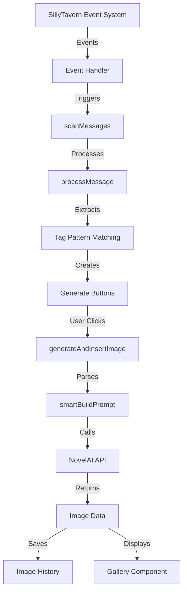

## 3. Event Handling System

The extension listens to various SillyTavern events to detect when messages are created, updated, or rendered.

### 3.1. Event Configuration

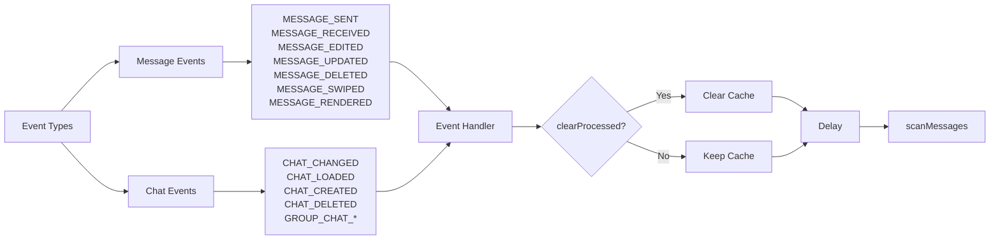

### 3.2. Event Processing Flow

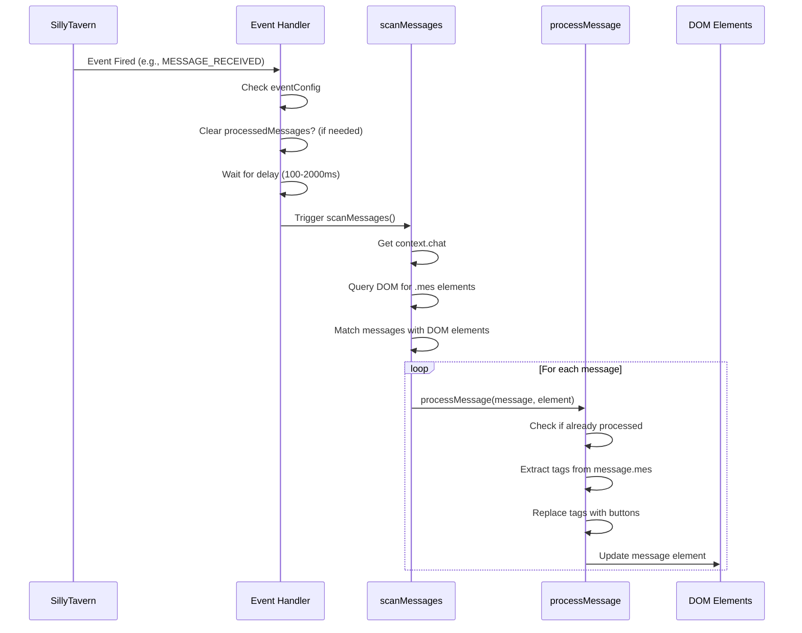

## 4. Message Processing Flow

### 4.1. Tag Detection and Replacement

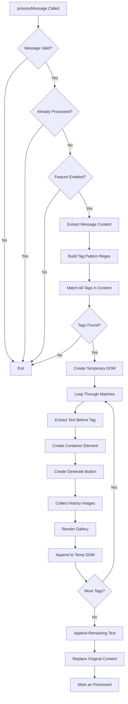

### 4.2. Tag Pattern Matching

The system uses configurable tag prefixes and suffixes (default: `[img:` and `]`) to identify image generation prompts:

```javascript
// Example: [img:cat playing in garden]
// Pattern: /\[img:([\s\S]*?)\]/g
// Match: fullTag = "[img:cat playing in garden]"
//        prompt = "cat playing in garden"
```

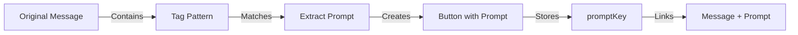

## 5. Prompt Processing Flow

### 5.1. Prompt Parsing Pipeline

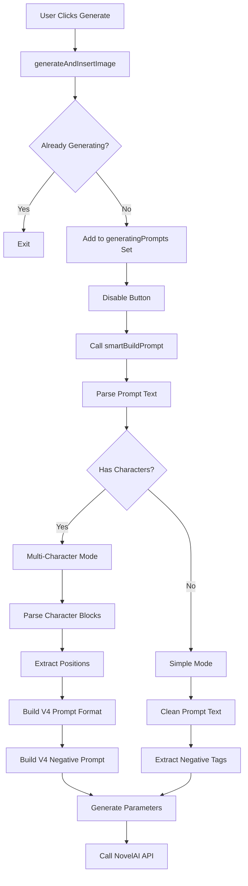

### 5.2. smartBuildPrompt Function

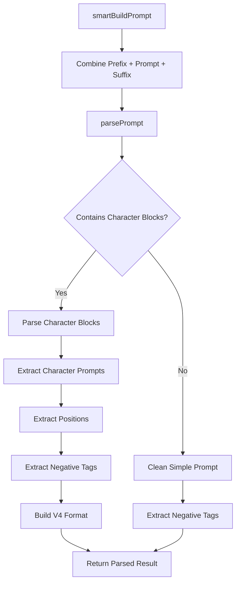

### 5.3. Character Block Parsing

For multi-character prompts, the system supports a special syntax:

```
{char character1 description, ntags = negative tags, {pos_x:0.3, pos_y:0.5} char}
```

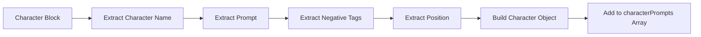

## 6. Image Generation and Storage

### 6.1. Generation Flow

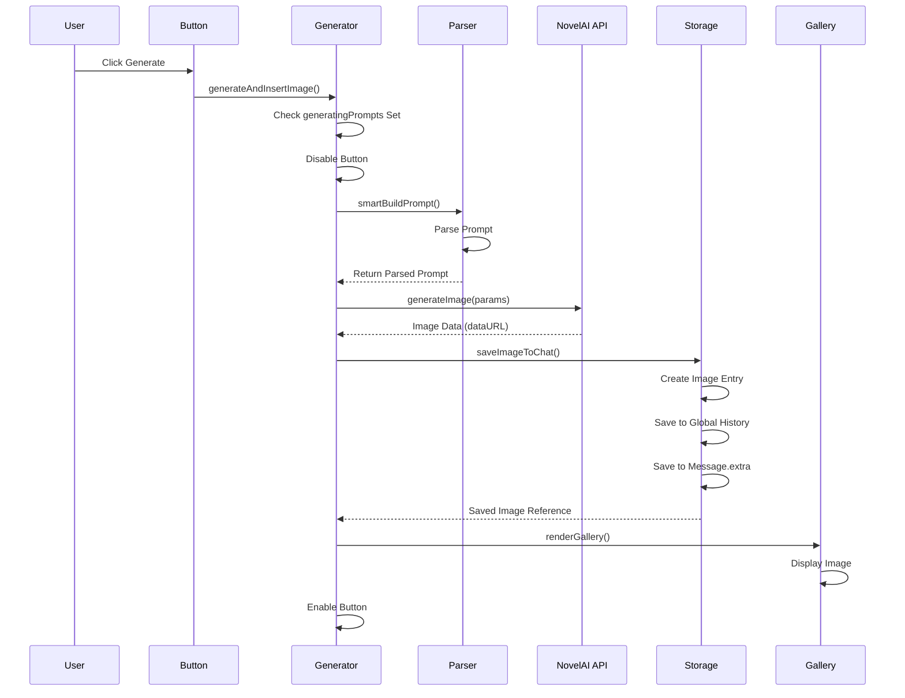

### 6.2. Image Storage Structure

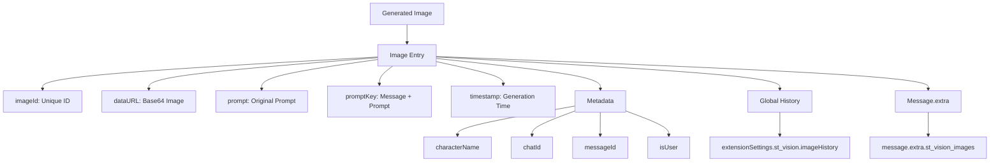

### 6.3. Image Retrieval

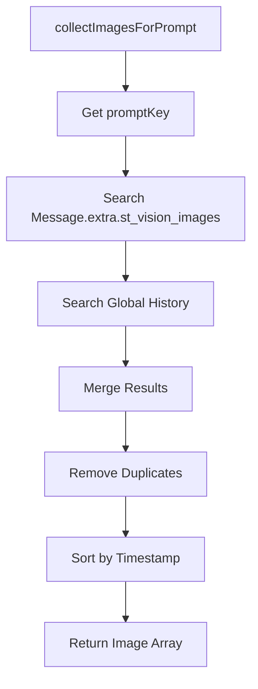

## 7. Complete Workflow Example

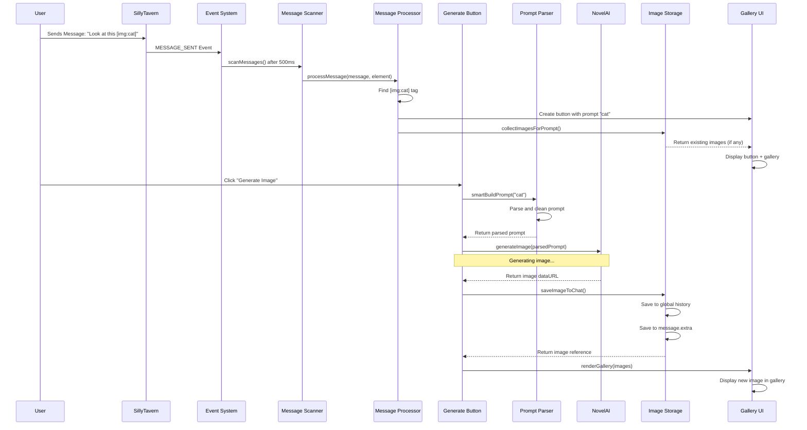

## 8. Key Components

### 8.1. Event Handler (`handleEvent`)
- Centralized event processing
- Configurable per-event behavior (clear cache, delay)
- Automatic handler registration/cleanup

### 8.2. Message Scanner (`scanMessages`)
- Iterates through all chat messages
- Matches messages with DOM elements using `mesid`
- Calls `processMessage` for each message

### 8.3. Message Processor (`processMessage`)
- Checks if message already processed (deduplication)
- Extracts image generation tags using regex
- Replaces tags with interactive UI elements
- Maintains text order and structure

### 8.4. Prompt Parser (`smartBuildPrompt`)
- Handles prefix/suffix combination
- Parses complex multi-character prompts
- Supports V4 format with coordinates
- Extracts negative prompts

### 8.5. Image Generator (`generateAndInsertImage`)
- Prevents duplicate generation (using Set)
- Updates UI during generation
- Calls NovelAI API
- Saves and displays results

### 8.6. Image Storage (`saveImageToChat`, `saveToGlobalHistory`)
- Saves to global extension settings
- Saves to message metadata
- Maintains history limit (1000 images)
- Creates unique image IDs

## 9. Configuration

The system uses configurable tag patterns:
- `tagPrefix`: Default `[img:`
- `tagSuffix`: Default `]`
- `enabled`: Feature toggle

These can be changed in the settings panel, and the regex pattern is dynamically rebuilt.

## 10. Performance Optimizations

1. **Message Deduplication**: Uses `processedMessages` Set to avoid reprocessing
2. **Generation Deduplication**: Uses `generatingPrompts` Set to prevent concurrent generation
3. **Event Debouncing**: Configurable delays prevent excessive scanning
4. **DOM Batching**: Creates temporary DOM, then replaces in one operation
5. **History Limit**: Caps global history at 1000 images

## 11. Error Handling

- Try-catch blocks around critical operations
- Button state restoration on errors
- Console logging for debugging
- User-friendly error messages
